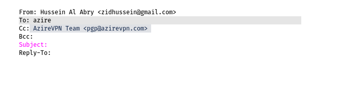

# coc-notmuch

notmuch completion for [coc.nvim](https://github.com/neoclide/coc.nvim).



## Install

In your vim/neovim, run command:

```
:CocInstall https://github.com/Nelyah/coc-notmuch
```

## Configuration

To activate coc completion through triggerPatterns only in mail filetype you can add this to your vimrc. 

Note: This will deactivate all completions not relying on triggerPatterns or triggerCharacters.

```
autocmd FileType mail call coc#config('suggest', {
    \ 'autoTrigger': 'trigger',
    \})
```


## License

MIT
